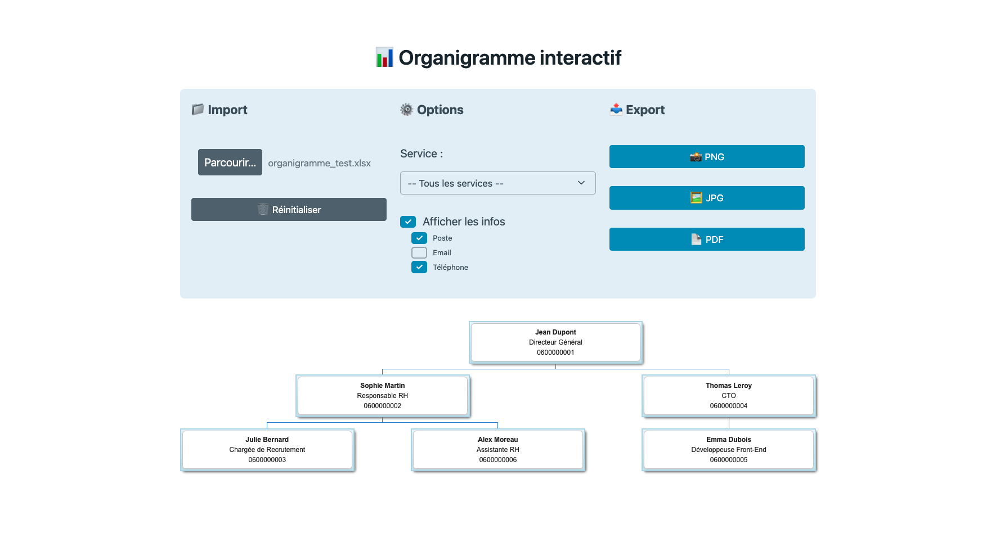

# 📊 Organigramme Interactif

Créez facilement un organigramme interactif et exportable à partir d’un fichier Excel (`.xlsx`).  
Le tout sans base de données, sans backend — 100% côté client.

 <!-- Remplacez ce chemin par une vraie image -->

---

## 🚀 Fonctionnalités

- ✅ Import d’un fichier Excel (.xlsx)
- ✅ Génération automatique de l’organigramme (via Google Charts)
- ✅ Filtres par service
- ✅ Affichage conditionnel des informations :
  - Poste
  - Email
  - Téléphone
- ✅ Exports :
  - 📸 PNG (fond transparent + marges)
  - 🖼 JPG (avec fond blanc + marges)
  - 📄 PDF (format A4 paysage)

---

## 🧩 Structure du fichier Excel

Le fichier `.xlsx` doit contenir une feuille avec les colonnes suivantes :

| Nom            | Manager        | Service | Poste              | Email                     | Téléphone    |
|----------------|----------------|---------|---------------------|---------------------------|--------------|
| Jean Dupont    |                | DG      | Directeur Général   | jean.dupont@exemple.com   | 0600000001   |
| Sophie Martin  | Jean Dupont    | RH      | Responsable RH      | sophie.martin@exemple.com | 0600000002   |
| ...            | ...            | ...     | ...                 | ...                       | ...          |

> 📝 L’application détecte automatiquement les responsables de service si leur `Manager` est externe au service.

---

## 🛠️ Technologies utilisées

- HTML / CSS (avec [PicoCSS](https://picocss.com))
- Vanilla JavaScript
- [Google Charts](https://developers.google.com/chart)
- [SheetJS](https://sheetjs.com/) (`xlsx`)
- [html2canvas](https://html2canvas.hertzen.com/)
- [jsPDF](https://github.com/parallax/jsPDF)

---

## 📂 Arborescence du projet

```
/orgchart
│
├── index.html
├── css/
│ └── index.css
├── js/
│ ├── app.js
│ ├── utils.js
│ └── export.js
├── assets/
│ └── ???
└── README.md
```

---

## 📦 Lancer le projet

## 📦 Lancer le projet

1. Clone le repo ou télécharge les fichiers :
   ```bash
   git clone https://github.com/votre-utilisateur/organigramme-interactif.git
   ```

2. Ouvre `index.html` dans ton navigateur. C’est tout !

---

## 💡 Améliorations possibles

- Drag & drop pour charger le fichier
- Sauvegarde automatique sur le navigateur
- Export SVG
- Mode impression

---

## 👥 Contribuer

Les contributions sont les bienvenues !  
N’hésitez pas à proposer des idées, signaler des bugs ou ouvrir des *pull requests*.

---

## 📄 Licence

Ce projet est sous licence MIT — libre d'utilisation, modification et distribution.
